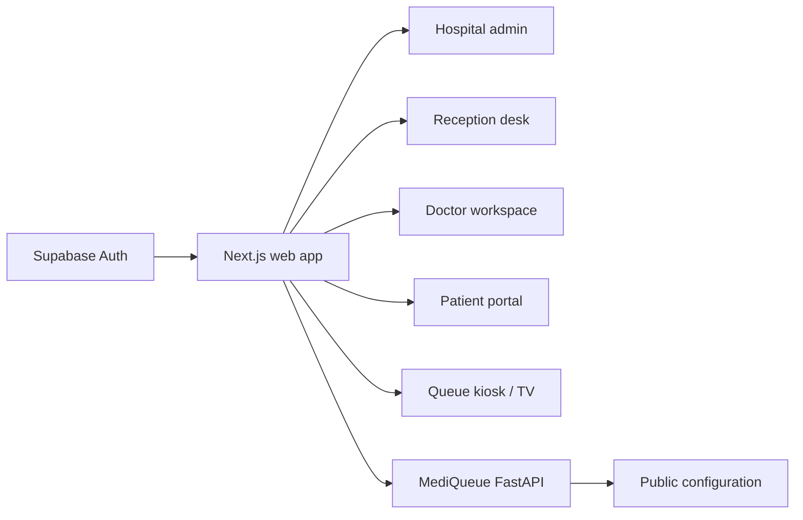

# MediQueue Frontend

> The planned role-based web experience for the MediQueue platform.

This repository is the frontend boundary for admin, reception, doctor, patient,
kiosk, queue-display, and TV experiences. The backend API and configuration
contracts are already available; the application UI is the next product slice.

## Product surfaces

## Planned stack

| Concern | Choice |
| --- | --- |
| Framework | Next.js + React + TypeScript |
| UI system | Tailwind CSS, shadcn/ui, Lucide |
| Server state | TanStack Query |
| Local state | Zustand |
| Forms | React Hook Form + Zod |
| Identity | Supabase Auth |
| API contract | Generated client from backend OpenAPI |
| Testing | Playwright, component tests, contract tests |

## Integration contract

The frontend should:

1. Authenticate with Supabase Auth, including Google OAuth when enabled.
2. Send the access token as `Authorization: Bearer <token>`.
3. Send `X-Tenant-ID` and `X-Branch-ID` for multi-branch scope.
4. Send a unique `Idempotency-Key` for check-in and call-next commands.
5. Fetch `/v1/config/public` for browser-safe feature and display settings.
6. Treat PostgreSQL-backed API responses as authoritative after realtime events
   or reconnects.

Live API references:

- [Documentation portal](https://mediqueue-backend-eta.vercel.app/docs)
- [Swagger](https://mediqueue-backend-eta.vercel.app/swagger)
- [OpenAPI contract](https://mediqueue-backend-eta.vercel.app/openapi.json)
- [Public configuration](https://mediqueue-backend-eta.vercel.app/v1/config/public)

## Local development

The application scaffold is intentionally not pretending to be production
ready yet. When the Next.js package is introduced, add the project commands
here and keep API types generated from the live OpenAPI contract rather than
duplicated manually.

## Design principles

- Keep clinical and queue data out of client-only state.
- Render UI from membership permissions returned by the API.
- Make waiting, loading, empty, error, and offline states explicit.
- Use accessible keyboard navigation for reception and kiosk workflows.
- Never place service-role keys or database credentials in the browser bundle.

See the [main repository](https://github.com/ChamathDilshanC/mediqueue) for the
platform architecture and [backend API guide](../backend/README.md) for the
current contract.
